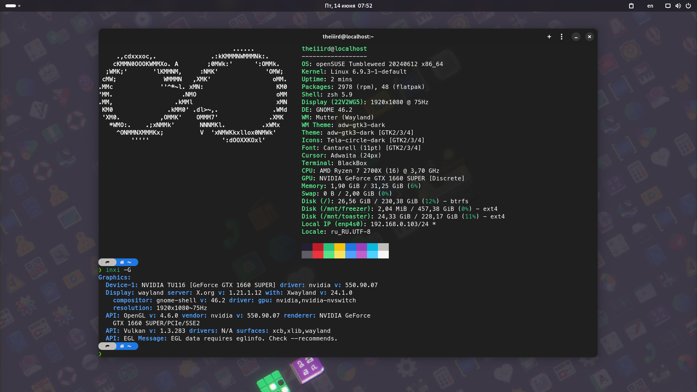
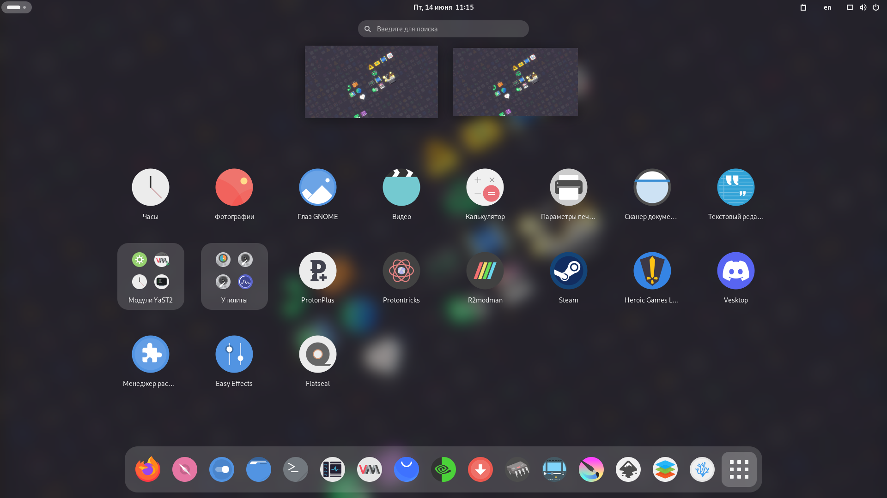
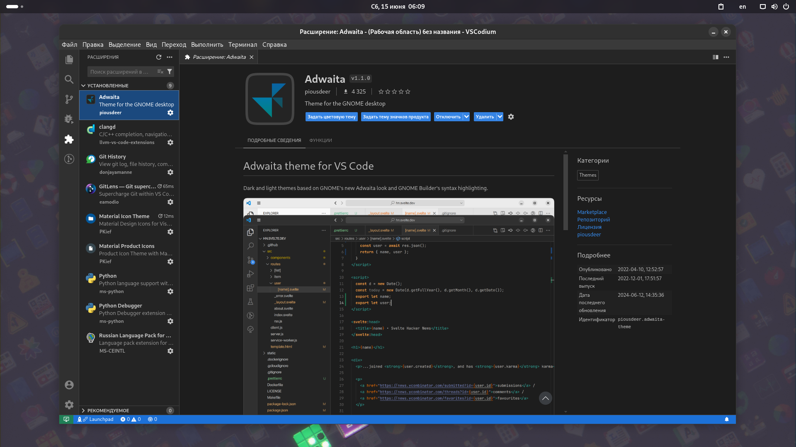
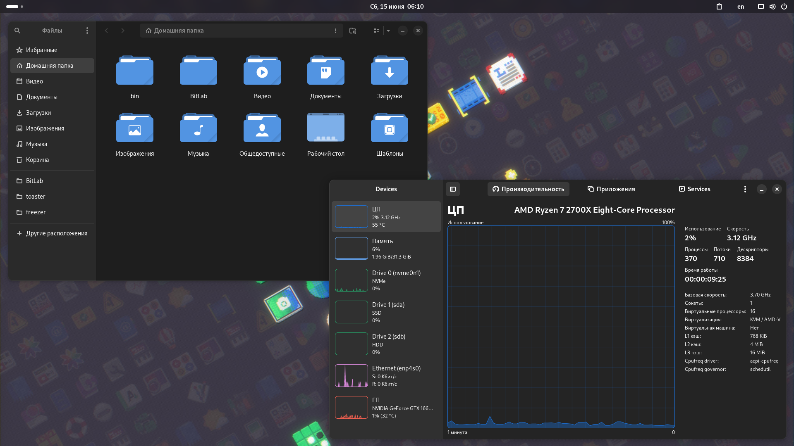

# OPENSUSE-CUSTOM-SETUP
One more way to customize opensuse.

<p align="center">
  
  
  
  
</p>


# Working with software

## Repository list configuration
After installation, you should open YaST and configure the software repositories.

- Make sure the local repository of the installation stick is turned off.
- Add the Nvidia and Pacman community repositories.

> `zypper ref` - refreshing a repository means downloading metadata of packages from the medium (if needed).
> 
> `zypper dup` - perform a distribution upgrade. This command applies the state of (specified) repositories onto the system; upgrades (or even downgrades) installed packages to versions found in repositories, removes packages that are no longer in the repositories and pose a dependency problem for the upgrade, handles package splits and renames, etc.
> 
> `zypper ve` - check whether dependencies of installed packages are satisfied. + In case that any dependency problems are found, zypper suggests packages to install or remove to fix them.

```sh
sudo zypper ref 
sudo zypper dup 
sudo zypper ve 
```


## Uninstalling software
By default, after installing the system, the workstation is overloaded with unnecessary programs. It is advisable to uninstall them so that they do not interfere with the use of the system.

- If you have installed KDE Plasma:
```sh
sudo zypper rm kmahjongg kmines kreversi ksudoku akregator kaddressbook konversation kmail kontact ktnef knotes kpat mbox-importer libkdegames kdegames-carddecks-default akonadi-contacts akonadi-import-wizard akonadi-calendar akonadi-calendar-tools opensuse-welcome 
```

- If you have installed GNOME:
```sh
sudo zypper rm gnome-contacts gnome-weather gnome-maps gnome-console gnome-mahjongg gnome-mines gnome-sudoku gnome-chess iagno lightsoff quadrapassel swell-foop cheese evolution polari opensuse-welcome 
```


## Installing useful software
Basic packages that we will need as we work with the system.

> git, wget2, curl, aria2 is needed to work with the internet.
> 
> inxi, fastfetch displays useful information about the system.
> 
> neovim is a powerful text editor.
> 
> zsh is a modern command shell.
> 
> OBS package installer analog of yay/paru.
> 
> java-21-openjdk, python311, python311-pip, gcc-c++, clang, clang-tools, mono-complete are needed to work with Java, Python C++ and C#.
> 
> dynamic kernel module support is needed to install the Nvidia driver.

```sh
sudo zypper in git wget2 curl aria2 inxi fastfetch neovim zsh opi java-21-openjdk python312 python312-pip gcc-c++ clang clang-tools mono-complete dkms 
```

If more than one version of Java is installed, this command will let you select the primary version:
```sh
sudo update-alternatives --config java 
```


## Nvidia graphics card driver installation
Proper (most likely) installation of the Nvidia driver on OpenSUSE with dependencies installed to make the Wayland protocol run smoothly.

> Starting the DKMS daemon. It is obligatory to reboot!
```sh
sudo zypper in dkms 
sudo systemctl enable dkms.service 
```

> After installation, make sure the system is not under load.
> plasma-systemmonitor gnome-system-monitor htop or btop.
```sh
sudo zypper in nvidia-compute-G06 nvidia-compute-G06-32bit nvidia-compute-utils-G06 nvidia-drivers-G06 nvidia-driver-G06-kmp-default nvidia-gl-G06 nvidia-gl-G06-32bit nvidia-utils-G06 nvidia-video-G06 nvidia-video-G06-32bit libnvidia-egl-wayland1 libnvidia-egl-wayland1-32bit 
```

> Or if you want to try open source Nvidia driver instead of proprietary, use this command:
```sh
sudo zypper in nvidia-open
```

> It is advisable to reboot again and check if the installation is correct using the following commands:
```sh
systemctl status dkms.service 
sudo zypper se nvidia 
nvidia-smi -q 
inxi -G 
```


## Installing additional software
A standard set of applications for a home computer.

- If you have installed KDE Plasma:
```sh
sudo zypper in torbrowser-launcher inkscape krita steam gamemode vlc partitionmanager 
```

- If you have installed GNOME:
```sh
sudo zypper in torbrowser-launcher inkscape krita steam gamemode vlc gparted gnome-font-viewer 
```


## Virt-manager installation
Virtual machine manager to work with QEMU/KVM.

```sh
sudo zypper in qemu-kvm bridge-utils virt-manager libguestfs guestfs-tools virt-install libvirt-devel libvirt 
```

> For virt-manager to work correctly, it is recommended to add a user to the libvirt group and to configure qemu.conf.
```sh
sudo usermod -G libvirt -a <username> 
```

> You have to change these lines: `user = "<username>"`, `group = "libvirt"`.
```sh
sudo vim /etc/libvirt/qemu.conf 
```

> Running libvirtd background processes:
```sh
sudo systemctl enable libvirtd 
```

## Installing codecs from Packman repositories
You need to play online or offline multimedia content but the content does not want to play or shows errors. Usually this is a sign of [missing codecs](https://en.opensuse.org/SDB:Installing_codecs_from_Packman_repositories): install these packages from Packman to play most music and video:

- ffmpeg
- gstreamer-plugins-good
- gstreamer-plugins-bad
- gstreamer-plugins-ugly
- gstreamer-plugins-libav
- libavcodec
- vlc-codecs

> Opi (Open Build Service Package Installer) works on both Leap and Tumbleweed, and is the easiest way to install community packages and the codecs:

```sh
sudo zypper in opi 
opi codecs 
```

> Or if you want to install the codec packages without `vlc-codecs` (if you don't plan on using the VideoLAN Client):
```sh
sudo zypper in ffmpeg gstreamer-plugins-{good,bad,ugly,libav} gstreamer-plugin-openh264 mozilla-openh264 libavcodec 
```


## Adding a flathub repository
[Flathub](https://flathub.org) makes it easy to install and update applications for any Linux distribution. Browse popular categories such as performance, graphics, games, and more, or find your favorite application.

> Check for a connected flathub repository. It should be enabled out of the box by default in OpenSUSE.
```sh
flatpak remotes --show-details 
```

> If not, this command will add the flathub repository to the list:
```sh
flatpak remote-add --if-not-exists flathub https://dl.flathub.org/repo/flathub.flatpakrepo 
```


## Flatpak application installation
Applications for fine-tuning your system, creating videos, programming, having fun.

> Installing a theme for GTK3 applications:
```sh
flatpak install org.gtk.Gtk3theme.adw-gtk3 org.gtk.Gtk3theme.adw-gtk3-dark 
```

- If you have installed KDE Plasma:
```sh
flatpak install flathub com.github.tchx84.Flatseal page.codeberg.libre_menu_editor.LibreMenuEditor com.github.wwmm.easyeffects com.vysp3r.ProtonPlus com.github.Matoking.protontricks org.onlyoffice.desktopeditors org.kde.kdenlive com.vscodium.codium dev.vencord.Vesktop com.heroicgameslauncher.hgl 
```

- If you have installed GNOME:
```sh
flatpak install flathub com.github.tchx84.Flatseal com.mattjakeman.ExtensionManager io.github.realmazharhussain.GdmSettings page.codeberg.libre_menu_editor.LibreMenuEditor com.github.wwmm.easyeffects io.missioncenter.MissionCenter com.raggesilver.BlackBox com.vysp3r.ProtonPlus com.github.Matoking.protontricks org.onlyoffice.desktopeditors org.kde.kdenlive com.vscodium.codium dev.vencord.Vesktop com.heroicgameslauncher.hgl 
```

> If you have problems with vscodium on Wayland session, you may use this command:
```sh
flatpak override --user --nosocket=wayland com.vscodium.codium 
```

> Add this to the settings if you want a custom title bar in vscodium:
```
{
  ...
   "window.titleBarStyle": "custom"
  ...
}
```


## Installing mod launcher for games
[Native launcher](https://github.com/ebkr/r2modmanPlus) for modding games.

> Download the [latest release](https://github.com/ebkr/r2modmanPlus/releases). R2modman.AppImage has the leading version in the name. It can be found in program releases.
```sh
wget https://github.com/ebkr/r2modmanPlus/releases/download/v3.1.48/r2modman-3.1.48.AppImage 
```

> Set permission to run the program:
```sh
chmod +x r2modman-3.1.48.AppImage 
```

> Create desktop shortcut: Don't forget to change `/path/to/r2modman.AppImage`!
```sh
cat >> ~/.local/share/applications/r2modman.desktop <<EOF
[Desktop Entry]
Name=R2modman
Comment=Infinite mod generator
Exec=/path/to/r2modman.AppImage --no-sandbox
Icon=fuse-emulator
Terminal=false
Type=Application
Categories=Game;
MimeType=x-scheme-handler/ror2mm;
EOF
```


## Installing the native engine for the game STALKER
[Engine for the STALKER](https://github.com/OpenXRay/xray-16) series of games. Makes the game native.

> Download the necessary dependencies.
```sh
sudo zypper in git cmake make gcc gcc-c++ glew-devel openal-devel cryptopp-devel libogg-devel libtheora-devel libvorbis-devel SDL2-devel lzo-devel libjpeg-turbo-devel 
```

> To get the source code, run:
```sh
git clone https://github.com/OpenXRay/xray-16.git --recurse-submodules 
```

> Enter the repository clone and create a building directory there. The name of the directory doesn't matter, e.g. bin or build (bin will be used for the rest of this documentation to refer to this directory). An example for creating the directory and entering it for the terminal:
```sh
cd xray-16 && mkdir bin && cd bin 
```

> Once you're inside of bin, configure the project by running:
```sh
cmake .. -DCMAKE_INSTALL_LIBDIR=lib64 -DCMAKE_INSTALL_PREFIX=/usr 
```

> To compile the engine, run:
```sh
make -jx 
```

> ! x denoted the number of threads you want to assign to the compile process. For example, if you want to use 4 threads:
```sh
make -j4 
```

> To make the engine, run:
```
QA_RPATHS=$(( 0x0001|0x0010 )) make package 
```

- To install via zypper, run:
```sh
sudo zypper in /path/to/<package_name>.rpm 
```

- To install via rpm, run:
```
sudo rpm -ivh /path/to/<package_name>.rpm 
```


## Installing the open source version of the Minecraft Launcher
[Launcher](https://llaun.ch) with open source code and convenient settings.

> Download the [latest release](https://llaun.ch/jar).
> Alternative sources [one](https://llaun.ch) or [two](https://lln4.ru).

> Create desktop shortcut: Don't forget to change `/path/to/LegacyLauncher_legacy.jar`!
```sh
cat >> ~/.local/share/applications/minecraft.desktop <<EOF
[Desktop Entry]
Name=Minecraft
Comment=Infinite idea generator
Exec=gamemoderun java -jar /path/to/LegacyLauncher_legacy.jar
Icon=minecraft
Terminal=false
Type=Application
Categories=Game;
EOF
```


## Fan control on MSI laptop

The application requires the `ec_sys` module with option `write_support=1` to run. If the `ec_sys` kernel module is not included in your distribution's kernel, you can use the `acpi_ec` kernel module.

> Checking for the ec_sys module:
```sh
sudo modinfo ec_sys 
```

> Create ec_sys.conf:
```sh
sudo vim /etc/modules-load.d/ec_sys.conf 
```

> Add this to ec_sys.conf:
```
# Load ec_sys at boot
ec_sys write_support=1
```

> Download `MControlCenter-x.x.x.tar.gz` from the [releases](https://github.com/dmitry-s93/MControlCenter/releases) page.
```sh
wget https://github.com/dmitry-s93/MControlCenter/releases/download/0.4.1/MControlCenter-0.4.1-bin.tar.gz 
```

> Unpack the archive with the program.
```sh
tar -xvf MControlCenter-0.4.1-bin.tar.gz 
```

> Open terminal in unpacked directory. Run the script.
```sh
sudo ./install 
```


## Zypper configuration
After installing the required packages, it is desirable to disable the installation of recommended packages by default so that the system remains clean when upgrading.

> Normally this parameter is on line 403 `solver.onlyRequires = true`.
```sh
sudo vim /etc/zypp/zypp.conf 
```


## System integrity verification

- Verify rpm packages:
```sh
sudo zypper ref 
sudo zypper dup 
sudo zypper ve 
```

- Verify flatpak packages:
```sh
flatpak update 
flatpak uninstall --unused 
flatpak repair 
```


# System customization

## Icon setup
> To make icons available to all users of the system, instead of `./install.sh standard`, run `sudo ./install.sh standard`.

> Traditional icons:
```sh
git clone https://github.com/vinceliuice/Tela-icon-theme.git 
cd Tela-icon-theme 
./install.sh standard 
```

> Rounded icons:
```sh
git clone https://github.com/vinceliuice/Tela-circle-icon-theme.git 
cd Tela-circle-icon-theme 
./install.sh standard 
```


## Installing the unofficial GTK3 port of libadwaita

> Install theme from [this](https://github.com/lassekongo83/adw-gtk3) repo.
```sh
wget https://github.com/lassekongo83/adw-gtk3/releases/download/v5.3/adw-gtk3v5.3.tar.xz 
```

> Unzip the archive:
```sh
tar -xvf adw-gtk3v5.3.tar.xz 
```

> Install theme:
```sh
sudo cp -r adw-gtk3 /usr/share/themes/ 
sudo cp -r adw-gtk3-dark /usr/share/themes/ 
```

> Add flatpak applications theme support:
```sh
flatpak install org.gtk.Gtk3theme.adw-gtk3 org.gtk.Gtk3theme.adw-gtk3-dark 
```


## ZSH installation and configuration
Install zsh and run it.

> Zsh will ask you to configure it after the first run.
> Look at all the items and click 0 in each if you are satisfied.
```sh
sudo zypper in zsh 
zsh 
```

> This font supports icons.
> It is necessary for correct output of information in the terminal.
```sh
wget https://github.com/romkatv/powerlevel10k-media/raw/master/MesloLGS%20NF%20Regular.ttf 
```


## Oh-my-zsh framework
Oh-my-zsh will extend the capabilities of regular zsh.

```sh
sh -c "$(wget -O- https://raw.githubusercontent.com/ohmyzsh/ohmyzsh/master/tools/install.sh)"
```


## Plugins for zsh
These extensions will provide hints while using zsh.

```sh
git clone https://github.com/zsh-users/zsh-syntax-highlighting.git ${ZSH_CUSTOM:-~/.oh-my-zsh/custom}/plugins/zsh-syntax-highlighting 
git clone https://github.com/zsh-users/zsh-autosuggestions.git ${ZSH_CUSTOM:-~/.oh-my-zsh/custom}/plugins/zsh-autosuggestions 
```

> After installing the zsh extensions, you should put them in `.zshrc`.
> 
> Open the config and find the line `plugins=(git)`.
> 
> It should be changed to `plugins=(git zsh-autosuggestions zsh-syntax-highlighting)`.
```sh
sed -i 's/^plugins=(git)$/plugins=(git zsh-autosuggestions zsh-syntax-highlighting)/g' ~/.zshrc 
```

> Restart the config
```sh
source .zshrc 
```


## P10K theme
P10k will make zsh more beautiful.

```sh
git clone --depth=1 https://github.com/romkatv/powerlevel10k.git ${ZSH_CUSTOM:-$HOME/.oh-my-zsh/custom}/themes/powerlevel10k 
```

> After installing the 10k, you should put them in `.zshrc`.
> 
> You must replace the value of ZSH_THEME with `ZSH_THEME="powerlevel10k/powerlevel10k"`.
```sh
sed -i 's/^ZSH_THEME="robbyrussell"$/ZSH_THEME="powerlevel10k/powerlevel10k"/g' ~/.zshrc 
```

> Restart the config
```sh
source .zshrc 
```


# Additional setup

## Icon management
Some application icons have no analogs in the Tela-icon set. By modifying the .desktop file, you can change the icon to your own as desired.

- Protontricks
```sh
cp --no-preserve=mode /var/lib/flatpak/exports/share/applications/com.github.Matoking.protontricks.desktop ~/.local/share/applications/com.github.Matoking.protontricks.desktop 
sed -i 's/^Icon=com.github.Matoking.protontricks$/Icon=katomic/g' ~/.local/share/applications/com.github.Matoking.protontricks.desktop 
```

- Vesktop
```sh
cp --no-preserve=mode /var/lib/flatpak/exports/share/applications/dev.vencord.Vesktop.desktop ~/.local/share/applications/dev.vencord.Vesktop.desktop 
sed -i 's/^Icon=dev.vencord.Vesktop$/Icon=discord/g' ~/.local/share/applications/dev.vencord.Vesktop.desktop 
```

- Dev Toolbox
```sh
cp --no-preserve=mode /var/lib/flatpak/exports/share/applications/me.iepure.devtoolbox.desktop ~/.local/share/applications/me.iepure.devtoolbox.desktop 
sed -i 's/^Icon=me.iepure.devtoolbox$/Icon=via/g' ~/.local/share/applications/me.iepure.devtoolbox.desktop 
```

- Libre Menu Editor
```sh
cp --no-preserve=mode /var/lib/flatpak/exports/share/applications/page.codeberg.libre_menu_editor.LibreMenuEditor.desktop ~/.local/share/applications/page.codeberg.libre_menu_editor.LibreMenuEditor.desktop 
sed -i 's/^Icon=page.codeberg.libre_menu_editor.LibreMenuEditor$/Icon=org.gnome.Tecla.svg/g' ~/.local/share/applications/page.codeberg.libre_menu_editor.LibreMenuEditor.desktop 
```

- Hieroglyphic
```sh
cp --no-preserve=mode /var/lib/flatpak/exports/share/applications/io.github.finefindus.Hieroglyphic.desktop ~/.local/share/applications/io.github.finefindus.Hieroglyphic.desktop 
sed -i 's/^Icon=io.github.finefindus.Hieroglyphic$/Icon=words/g' ~/.local/share/applications/io.github.finefindus.Hieroglyphic.desktop
```


## Advanced application suite
Additional set of applications for work

> A set of applications for organizing photos, working with 3D graphics and recording videos.
```sh
sudo zypper in darktable blender 
opi obs-studio 
```

> Software for downloading data, editing text, 2FA, working with music, creating plans and etc.
```sh
flatpak install flathub org.gnome.gitlab.somas.Apostrophe com.belmoussaoui.Authenticator dev.geopjr.Collision com.github.huluti.Curtail me.iepure.devtoolbox app.drey.EarTag com.github.neithern.g4music org.gaphor.Gaphor se.sjoerd.Graphs io.github.finefindus.Hieroglyphic com.belmoussaoui.Obfuscate io.gitlab.adhami3310.Impression fr.romainvigier.MetadataCleaner io.github.alainm23.planify com.github.ADBeveridge.Raider com.github.flxzt.rnote io.gitlab.adhami3310.Converter org.tenacityaudio.Tenacity 
```

## GNOME extensions
[Extensions](https://extensions.gnome.org) for GNOME that can improve the experience of using the system.

### Quick Lang Switch
Quickly switch keyboard language layout without showing the switcher popup.

<p align="center">
  
</p>

```
quick-lang-switch@ankostis.gmail.com
```

### AppIndicator and KStatusNotifierItem Support
Adds AppIndicator, KStatusNotifierItem and legacy Tray icons support to the Shell.

<p align="center">
  
</p>

```
appindicatorsupport@rgcjonas.gmail.com
```

### Blur my Shell
Adds a blur look to different parts of the GNOME Shell, including the top panel, dash and overview.

<p align="center">
  
</p>

```
blur-my-shell@aunetx
```


### Clipboard Indicator
The most popular clipboard manager for GNOME, with over 1M downloads.

<p align="center">
  
</p>

```
clipboard-indicator@tudmotu.com
```

### Caffeine
Disable the screensaver and auto suspend.

<p align="center">
  
</p>

```
caffeine@patapon.info
```

### Vitals
A glimpse into your computer's temperature, voltage, fan speed, memory usage, processor load, system resources, network speed and storage stats. This is a one stop shop to monitor all of your vital sensors. Uses asynchronous polling to provide a smooth user experience.

<p align="center">
  
</p>

```
Vitals@CoreCoding.com
```

### Just Perfection
Tweak Tool to Customize GNOME Shell, Change the Behavior and Disable UI Elements.

<p align="center">
  
</p>

```
just-perfection-desktop@just-perfection
```
